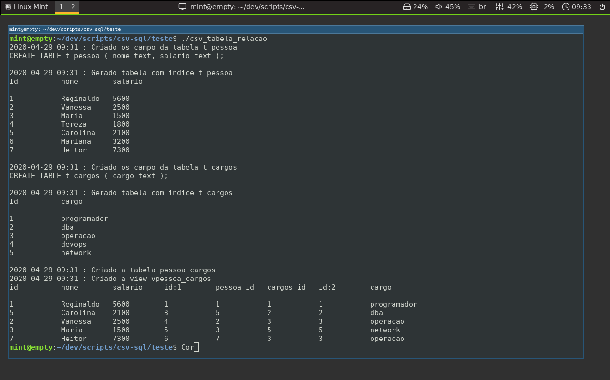

----
# csv_sql

Cria um banco de dados a partir do csv e cria relação entre as tabelas  

```sh
cd teste/ 
./csv_tabela_relacao  
```



Tarefas a ser implementado 

- [x]  CRUD Create Read Update Delete.

- [x]  Le arquivos CSV gerando uma tabela com indice.

- [x]  Cria relação N para N

- [ ]  Controle de acesso.

- [ ]  Hash de assinatura de modificação de arquivo.

- [ ]  Interface para em Dialog. 

[Post LinkedIn](https://www.linkedin.com/pulse/transforme-planilhas-em-banco-relacionados-reginaldo-ferreira-silva/?published=t)

&copy; 2020  regiefe@gmail.com
