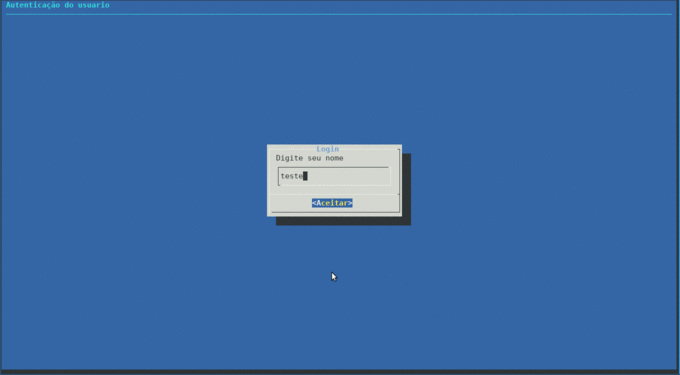

# csv-sql 

Conversor arquivo CSV em tabela no Sqlite3 e cria relação entre tabelas.   

----

### Dependeciaas
docker

### Instalação      

```sh
git clone https://github.com/regiefe/csv-sql.git
cd csv-sql
docker build -t  m-csv-sql .
docker run -it m-csv-sql
cd /csv-sql
./start.sh
```



###  Tarefas a ser implementado

- [x] CRUD Create Read Update Delete.

- [x] Le arquivos CSV gerando uma tabela com indice.

- [x] Cria relação N para N

- [X] Controle de acesso.

- [x] Criar uma interface para em Dialog. 

- [x] Dockerfile implementado

- [ ] Converte banco de dados em Planilha

- [ ] Hash de assinatura de modificação de arquivo.


[Post LinkedIn](https://www.linkedin.com/pulse/transforme-planilhas-em-banco-relacionados-reginaldo-ferreira-silva/?published=t)


&copy; 2021  regiefe@gmail.com

