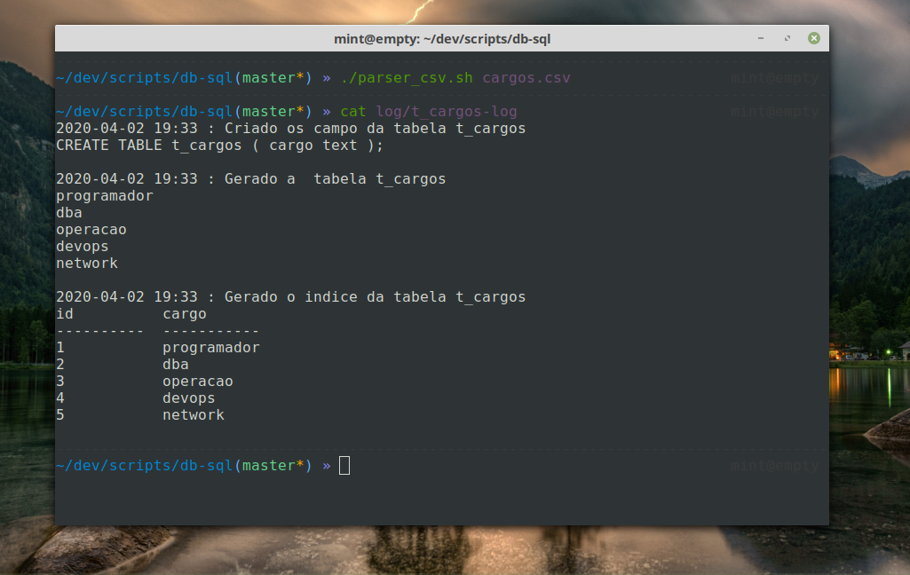

----
# csv_sql
gera arquivo  sql a partir de um arquivo cvs



## Instalação

----

```
git clone git@github.com:regiefe/db-sql.git

```
## Mode de usar

```
cd csv_sql/App
./parser_cvs [ caminho do .csv  ]

```
Tarefas a ser implementado 

- [ ]  Cria relação 1 para N
>> importar o id de N para o relacionamento
- [ ]  Cria relação N para N
- >> cria uma nova tabela com id e as 2  chaves estrangeiras que vai relacionar 
- [ ]  Criar uma interface para em Dialog 
>> interface para ser logar e ter a algumas arias restritas
- [ ]  Controle de usuario
>> inserir, remover, listar e atualizar usuario 
 
